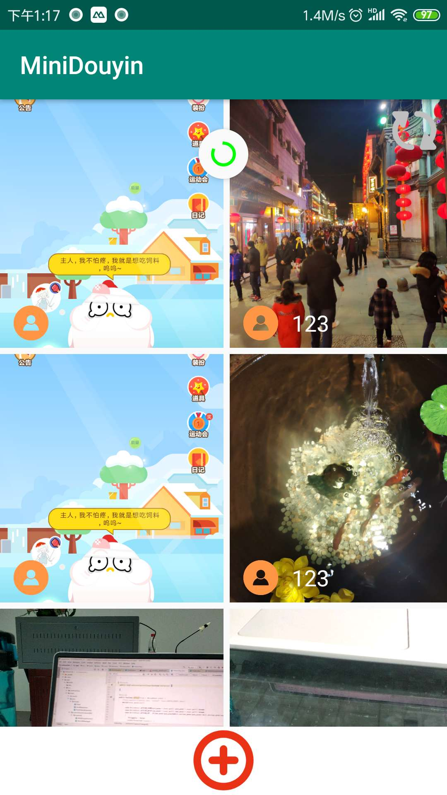
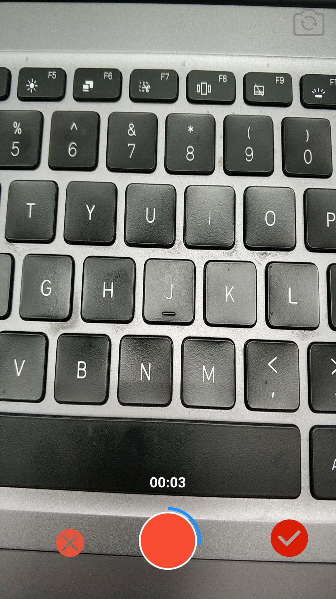

# MiniDouyin
project : mini-version of Douyin

## 大作业的记录

### 1.项目目录结构
```
.
├── build.gradle
├── proguard-rules.pro
└── src
    ├── androidTest
    │   └── java/cn/edu/bit/codesky/minidouyin
    │                           └── ExampleInstrumentedTest.java
    ├── main
    │   ├── AndroidManifest.xml
    │   ├── java/cn/edu/bit/codesky/minidouyin
    │   │                       ├── adapter 
    │   │                       │   ├── StaggeredItemDecoration.java  
    │   │                       │   └── VideoListAdapter.java  (RecyclerView的Adapter)
    │   │                       ├── beans   （网络传输的pojo）
    │   │                       │   ├── datafeed.java
    │   │                       │   ├── Feed.java
    │   │                       │   ├── FeedResponse.java
    │   │                       │   ├── PostVideoResponse.java
    │   │                       │   └── ResponseItem.java
    │   │                       ├── db   (保存点赞操作的数据库)
    │   │                       │   ├── VideoContract.java
    │   │                       │   └── VideoDbHelper.java
    │   │                       ├── MainActivity.java    （视频流列表）首页
    │   │                       ├── MyClickListener.java
    │   │                       ├── ui
    │   │                       │   ├── VideoDetailActivity.java (视频详情页Activity)
    │   │                       │   ├── VideoRecordActivity.java (视频录制页Activity)
    │   │                       │   └── VideoUploadActivity.java (视频上传Activity)
    │   │                       ├── util (一些工具类)
    │   │                       │   ├── IMiniDouyinService.java
    │   │                       │   ├── NetworkUtils.java
    │   │                       │   ├── ResourceUtils.java
    │   │                       │   ├── RetrofitManager.java 
    │   │                       │   ├── UriUtils.java
    │   │                       │   └── Utils.java
    │   │                       └── widget
    │   │                           ├── CircleImageView.java (老师给的自定义圆形头像ImageView)
    │   │                           └── CircleProgressBarView.java  (自定义的圆形进度条组件)
    │   └── res
    │       ├── drawable
    │       │   ├── change_camera.png
    │       │   ├── default_avatar.png
    │       │   ├── delete_button_bg.png
    │       │   ├── heart_big.png
    │       │   ├── heart.png
    │       │   ├── heart_r.png
    │       │   ├── ic_launcher_background.xml
    │       │   ├── next_step_bg1.png
    │       │   ├── next_step_bg.png
    │       │   ├── publish_btn_bg.png
    │       │   ├── record_button_bg.png
    │       │   ├── record_button_bg_unenable.png
    │       │   ├── record_button_selector.xml
    │       │   ├── record_video_button.png
    │       │   └── refresh_btn_bg.png
    │       ├── drawable-v24
    │       │   └── ic_launcher_foreground.xml
    │       ├── layout
    │       │   ├── activity_main.xml
    │       │   ├── activity_video_detail.xml
    │       │   ├── activity_video_record.xml
    │       │   ├── activity_video_upload.xml
    │       │   └── video_item_list.xml
    │       ├── mipmap-anydpi-v26
    │       │   ├── ic_launcher_round.xml
    │       │   └── ic_launcher.xml
    │       ├── mipmap-hdpi
    │       │   ├── ic_launcher.png
    │       │   └── ic_launcher_round.png
    │       ├── mipmap-mdpi
    │       │   ├── ic_launcher.png
    │       │   └── ic_launcher_round.png
    │       ├── mipmap-xhdpi
    │       │   ├── ic_launcher.png
    │       │   └── ic_launcher_round.png
    │       ├── mipmap-xxhdpi
    │       │   ├── default_disp.jpg
    │       │   ├── error_disp.png
    │       │   ├── ic_launcher.png
    │       │   └── ic_launcher_round.png
    │       ├── mipmap-xxxhdpi
    │       │   ├── ic_launcher.png
    │       │   └── ic_launcher_round.png
    │       └── values
    │           ├── colors.xml
    │           ├── dimens.xml
    │           ├── strings.xml
    │           └── styles.xml
```
### 2.功能要点

#### 2.1 下拉刷新视频信息流功能
通过Google官方提供的`SwipeRefreshLayout`组件，监听下拉刷新事件:`setOnRefreshListener`。

#### 2.2 视频列表瀑布流显示
采用了`StaggeredGridLayoutManager`布局管理器实现，为了图片显示效果好看，用`Glide`对图片进行了`CenterCrop`操作。

<p align="center">
    
    <p align="center">
        <em>视频列表页</em>
    </p>
</p>

#### 2.3 主要创新点：视频录制功能，增加很多新功能

视频限制最大录制时间为10秒，但是存在一个bug,由于多线程执行的原因造成可能多录制1秒。

* 10秒自动结束录制功能

* 如果录制不满意，可以删除视频，再重新录制

* 实现双指手势缩放相机焦距

* 暂停/继续录制功能，即多段视频合成

* 视频压缩功能，由于本机录制视频一般体积较大，为了节约上传流量，通过修改分辨率和比特率来压缩视频，10秒的视频能压缩到15M

> 引用了第三方的基于ffmpeg封装的视频处理库：
> https://github.com/yangjie10930/EpMedia

**视频录制界面：**
<p align="center">
    
    <p align="center">
        <em>视频录制</em>
    </p>
</p>

**录制功能演示效果如下所示：**

删除视频/重新录制功能 、 视频暂停/继续录制功能 、视频处理功能（合并/压缩）

(视频处理过程添加进度条显示，但是第三方库存在处理进度值回调出来的值存在一些bug，导致动画初始值可能为100%)

<p align="center">
    
    <p align="center">
        <em>视频录制过程</em>
    </p>
</p>


**注意：为了代码不混乱，且视频录制新功能可能存在bug，视频录制的新功能在video_record_addition分支上。**
